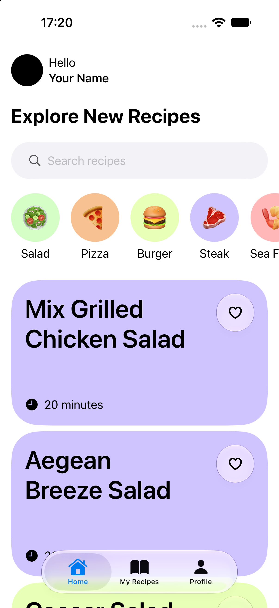
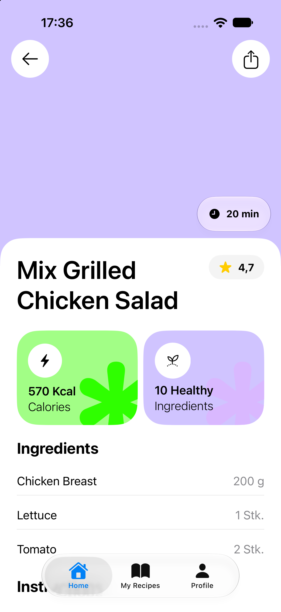

# Recipe App
In this project I try to recreate a iOS App from a Dribbble design. This is all about learning SwiftUI and Swift. I also rethink about how to make it more usable.

# Dribbble design

# Current implementation

